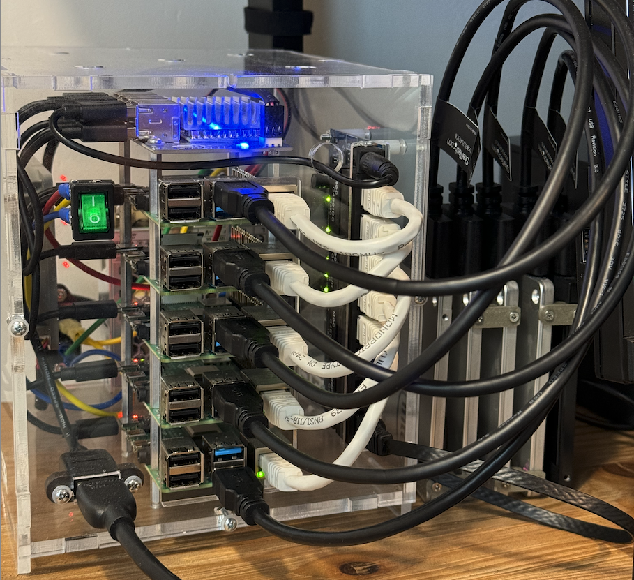

# Kubernetes Pi Cluster

This repo is retired. See my [homeops](https://github.com/brettinternet/homeops).

[](https://github.com/brettinternet/cluster/actions/workflows/lint.yaml)



## Features

- Lots of [self-hosted services](./kubernetes/apps)
- [Flux](https://toolkit.fluxcd.io/) GitOps with this repository ([kubernetes directory](./kubernetes))
- Ansible node provisioning and [K3s setup](https://github.com/PyratLabs/ansible-role-k3s) (Ansible [roles](./ansible/roles) and [playbooks](./ansible))
- [SOPS](https://github.com/mozilla/sops) secrets stored in Git
- [Renovate bot](https://github.com/renovatebot/renovate) dependency updates
- [Cloudflared HTTP tunnel](https://github.com/cloudflare/cloudflared)
- [K8s gateway](https://github.com/ori-edge/k8s_gateway) for local DNS resolution to the cluster and [NGINX ingress controller](https://kubernetes.github.io/ingress-nginx/)
- Both internal & external services with a service [gateway](https://github.com/ori-edge/k8s_gateway/)
- OIDC [authentication](https://www.authelia.com/configuration/identity-providers/open-id-connect/) with [LDAP](https://github.com/glauth/glauth)
- Automatic Cloudflare DNS updates with [external-dns](./kubernetes/apps/network/external-dns/app/helmrelease.yaml)
- [Cilium](https://cilium.io/) container networking interface (CNI) and [layer 4 loadbalancing](https://cilium.io/use-cases/load-balancer/)
- [CloudNative-PG](https://cloudnative-pg.io/) with automatic failover
- [kube-prometheus-stack](https://github.com/prometheus-community/helm-charts/tree/main/charts/kube-prometheus-stack) with various Grafana dashboards
- [go-task](https://taskfile.dev) shorthand for useful commands ([Taskfile](./Taskfile.yaml) and [taskfiles](./.taskfiles))

## Hardware

I'm using Raspberry Pi 4 (x 5) but the 4 GB RAM models are hungry for more memory. [Micro SD cards are insufficient](https://gist.github.com/brettinternet/94d6d8a1e01f4a90b6dfdc70d6b4a5e5) for etcd's demanding read/writes, so I recommend SATA over USB 3.0. Check out [this guide](https://jamesachambers.com/new-raspberry-pi-4-bootloader-usb-network-boot-guide/) for compatible interfaces. I use a [PicoCluster case](https://www.picocluster.com/collections/pico-5).

## Software

Setup and usage is inspired heavily by [this homelab gitops template](https://github.com/onedr0p/flux-cluster-template) and the [k8s-at-home](https://github.com/k8s-at-home) community. You can find similar setups with the [k8s at home search](https://nanne.dev/k8s-at-home-search/). See my other [homelab](https://github.com/brettinternet/homelab) setups.

### Setup

#### Dependencies

[Install go-task](https://taskfile.dev/installation/)

Install dependencies and setup environment:

```sh
task init
```

#### Provision

Then, provision your infrastructure:

```sh
task ansible:{init,list,ping,setup,install,status}
```

#### DNS and Tunnel

Setup a Cloudflare Tunnel.

```sh
cloudflared tunnel login
cloudflared tunnel create cluster
```

Add the tunnel's `credentials.json` to the value in [`cloudflared-secret`](kubernetes/apps/network/cloudflared/app/secret.sops.yaml) and tunnel ID to `cluster-secrets.sops.yaml`.

Add a Cloudflare API token with these permissions to the value in [`external-dns-secret`](kubernetes/apps/network/external-dns/app/secret.sops.yaml).

- `Zone - DNS - Edit`
- `Account - Cloudflare Tunnel - Read`

### Deploy

#### Kubernetes

Verify flux can be installed. Then, push changes to remote repo and install.

```sh
task flux:{verify,install}
```

Push latest to repo - you can use the [wip.sh](./scripts/wip.sh) script for that with `task wip`.

```sh
task flux:reconcile
```

```sh
task kubernetes:resources
```

Most deployments in this repo use an `app-template` chart with [these configuration options](https://github.com/bjw-s/helm-charts/tree/main/charts/library/common).
